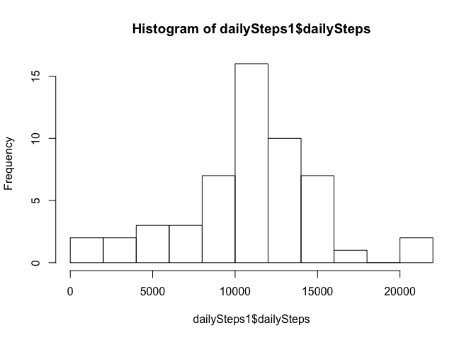
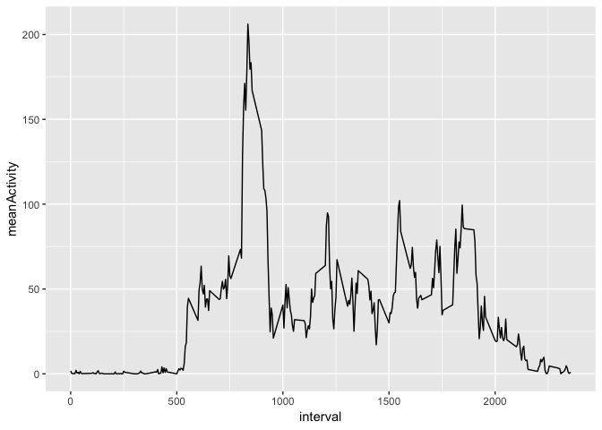
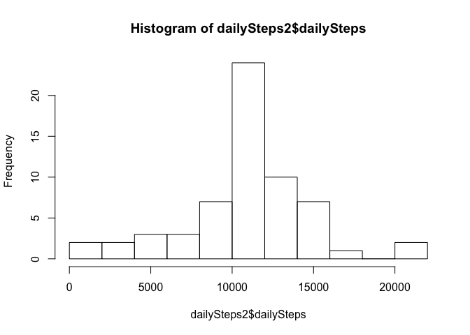

## Introduction
It is now possible to collect a large amount of data about personal movement using activity monitoring devices such as a Fitbit, [Nike](http://www.fitbit.com/) [Fuelband](http://www.nike.com/us/en_us/c/nikeplus-fuelband), or [Jawbone Up](https://jawbone.com/up). These type of devices are part of the “quantified self” movement – a group of enthusiasts who take measurements about themselves regularly to improve their health, to find patterns in their behavior, or because they are tech geeks. But these data remain under-utilized both because the raw data are hard to obtain and there is a lack of statistical methods and software for processing and interpreting the data.

This assignment makes use of data from a personal activity monitoring device. This device collects data at 5 minute intervals through out the day. The data consists of two months of data from an anonymous individual collected during the months of October and November, 2012 and include the number of steps taken in 5 minute intervals each day.

The data for this assignment can be downloaded from the course web site:

Dataset: [Activity monitoring data](https://d396qusza40orc.cloudfront.net/repdata%2Fdata%2Factivity.zip) [52K]
The variables included in this dataset are:

* **steps**: Number of steps taking in a 5-minute interval (missing values are coded as \color{red}{\verb|NA|}NA)
* **date**: The date on which the measurement was taken in YYYY-MM-DD format
* **interval**: Identifier for the 5-minute interval in which measurement was taken
The dataset is stored in a comma-separated-value (CSV) file and there are a total of 17,568 observations in this dataset.

## Load required libraries


```
## Warning: package 'dplyr' was built under R version 3.5.1
```

```
## 
## Attaching package: 'dplyr'
```

```
## The following objects are masked from 'package:stats':
## 
##     filter, lag
```

```
## The following objects are masked from 'package:base':
## 
##     intersect, setdiff, setequal, union
```

## Loading and preprocessing the data

1. Load the data (i.e. \color{red}{\verb|read.csv()|}read.csv())
2. Process/transform the data (if necessary) into a format suitable for your analysis,


```r
data <- read.csv("activity.csv")

# format date column as valid Date format
data$date <- as.Date(data$date)

# generate data summary
summary(data)
```

```
##      steps             date               interval     
##  Min.   :  0.00   Min.   :2012-10-01   Min.   :   0.0  
##  1st Qu.:  0.00   1st Qu.:2012-10-16   1st Qu.: 588.8  
##  Median :  0.00   Median :2012-10-31   Median :1177.5  
##  Mean   : 37.38   Mean   :2012-10-31   Mean   :1177.5  
##  3rd Qu.: 12.00   3rd Qu.:2012-11-15   3rd Qu.:1766.2  
##  Max.   :806.00   Max.   :2012-11-30   Max.   :2355.0  
##  NA's   :2304
```

## What is mean total number of steps taken per day?
For this part of the assignment, you can ignore the missing values in the dataset.

1. Calculate the total number of steps taken per day


```r
# calculate total steps by each day
dailySteps1 <- data %>% group_by(date) %>% summarize(dailySteps=sum(steps))
summary(dailySteps1$dailySteps)
```

```
##    Min. 1st Qu.  Median    Mean 3rd Qu.    Max.    NA's 
##      41    8841   10765   10766   13294   21194       8
```

2. Make a histogram of the total number of steps taken each day


```r
hist(dailySteps1$dailySteps, breaks = 10)
```

<!-- -->

3. Calculate and report the mean and median of the total number of steps taken per day


```r
# calculate mean daily steps for all days
meanDailySteps1 <- mean(dailySteps1$dailySteps, na.rm = TRUE)
```
* mean daily steps are 1.0766189\times 10^{4}

```r
# calculate median daily steps
medianDailySteps1 <- median(dailySteps1$dailySteps, na.rm = TRUE)
```
* median daily step are 10765

## What is the average daily activity pattern?
Make a time series plot of the 5-minute interval (x-axis) and the average number of steps taken, averaged across all days (y-axis)


```r
dailyPattern <- data %>% group_by(interval) %>% summarize(meanActivity = mean(steps, na.rm = TRUE))

dailyPattern %>% ggplot(aes(interval, meanActivity)) + geom_line()
```

<!-- -->

Which 5-minute interval, on average across all the days in the dataset, contains the maximum number of steps?


```r
dailyPattern[which.max(dailyPattern$meanActivity),]
```

```
## # A tibble: 1 x 2
##   interval meanActivity
##      <int>        <dbl>
## 1      835         206.
```

## Imputing missing values
1. Calculate and report the total number of missing values in the dataset (i.e. the total number of rows with NAs)

```r
sum(is.na(data$steps))
```

```
## [1] 2304
```

2. Devise a strategy for filling in all of the missing values in the dataset. The strategy does not need to be sophisticated. For example, you could use the mean/median for that day, or the mean for that 5-minute interval, etc.

**there is a fluctuation of activity based on the time of the day and we can use average for each 5 minute slot to fill the missing values**

3. Create a new dataset that is equal to the original dataset but with the missing data filled in.


```r
newData <- data %>% 
             group_by(interval) %>% 
             mutate(steps= ifelse(is.na(steps), mean(steps, na.rm=TRUE), steps))
sum(is.na(newData$steps))
```

```
## [1] 0
```

4. Make a histogram of the total number of steps taken each day and Calculate and report the mean and median total number of steps taken per day. Do these values differ from the estimates from the first part of the assignment? What is the impact of imputing missing data on the estimates of the total daily number of steps?


```r
# calculate total steps by each day
dailySteps2 <- newData %>% group_by(date) %>% summarize(dailySteps=sum(steps))
hist(dailySteps2$dailySteps, breaks = 10)
```

<!-- -->


```r
# calculate mean daily steps for all days
meanDailySteps2 <- mean(dailySteps2$dailySteps, na.rm = TRUE)
```
* mean daily steps are 1.0766189\times 10^{4}

```r
# calculate median daily steps
medianDailySteps2 <- median(dailySteps2$dailySteps, na.rm = TRUE)
```
* median daily step are 1.0766189\times 10^{4}

## Are there differences in activity patterns between weekdays and weekends?
For this part the \color{red}{\verb|weekdays()|}weekdays() function may be of some help here. Use the dataset with the filled-in missing values for this part.

Create a new factor variable in the dataset with two levels – “weekday” and “weekend” indicating whether a given date is a weekday or weekend day.
Make a panel plot containing a time series plot (i.e. \color{red}{\verb|type = "l"|}type="l") of the 5-minute interval (x-axis) and the average number of steps taken, averaged across all weekday days or weekend days (y-axis). See the README file in the GitHub repository to see an example of what this plot should look like using simulated data.

